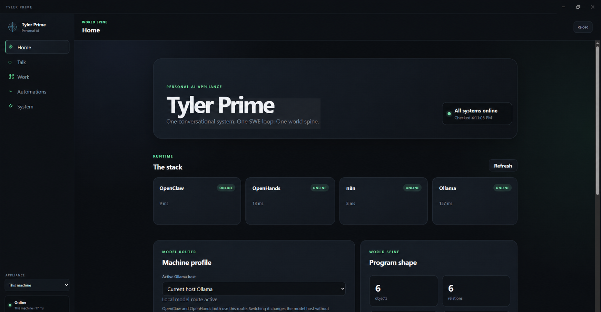
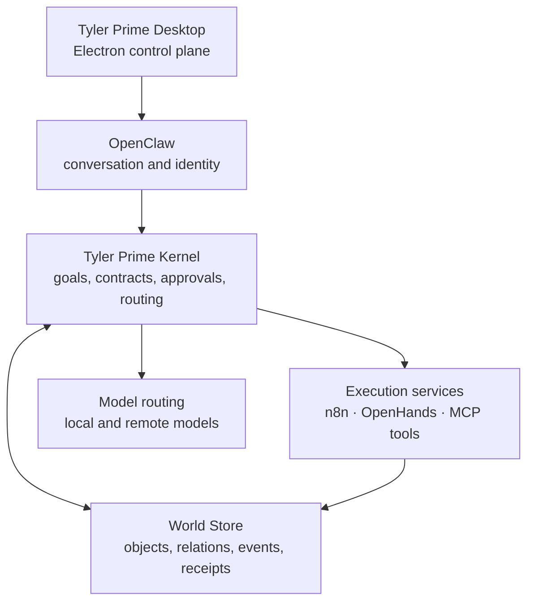

# Tyler Prime

**A local-first personal AI appliance for governed automation, durable context, and operational work.**

Tyler Prime is an ongoing systems-engineering project exploring what happens when conversational AI, software-engineering agents, automation, model routing, observability, and structured world data are designed as parts of one controlled system—not as a collection of disconnected chat windows and web services.

> This repository is the public engineering record for Tyler Prime. It describes the architecture, design decisions, current capabilities, and development roadmap. The private implementation, personal data, credentials, operational configuration, and security-sensitive deployment details are intentionally excluded.

## Running interface

The current desktop shell provides one operational surface for the appliance while preserving the boundaries between the services behind it.

*Home: runtime health, service latency, model routing, and the current World Spine shape.*

*Talk: the conversational interface embedded inside the Tyler Prime desktop control plane.*

## The problem

Modern AI tools are individually capable but operationally fragmented. Conversations lose context. Automations run without a shared model of the world. Coding agents work in isolated repositories. Local and cloud models have different costs and capabilities. Actions, approvals, evidence, and outcomes are rarely captured in one durable system.

Tyler Prime is being built to connect those pieces behind a single desktop control plane while preserving boundaries between:

- conversation and execution;
- durable evidence and temporary context;
- automation and decision authority;
- personal data and public documentation;
- local capability and cloud escalation.

## System shape

## Core components

| Component | Responsibility | Current state |
|---|---|---|
| Tyler Prime Desktop | One desktop surface for conversation, workflows, data, and operations | Implemented; expanding |
| OpenClaw | Tyler-facing conversational and identity layer | Implemented; integrating |
| Tyler Prime Kernel | Goals, task contracts, approvals, permissions, and routing | In development |
| World Store | Durable objects, relations, events, receipts, and model-routing records | Implemented; evolving |
| n8n | Scheduled work, webhooks, supervision, alerts, and outside-service edges | Implemented; integrating |
| OpenHands | Bounded software-engineering worker | Prototype/integration |
| Ollama and model profiles | Route work across local and remote models by machine capability | Implemented; evolving |
| Observability | System metrics, dashboards, logs, and model/tool traces | Partially implemented |
| Market Lab | A domain system for market and prediction data connected through controlled boundaries | Separate system; integrating |

## Example task lifecycle

A future-complete Tyler Prime task follows a controlled lifecycle:

1. Tyler states a goal through the conversational interface.
2. The kernel converts the request into a bounded task contract.
3. Relevant objects and prior evidence are retrieved from the World Store.
4. Work is routed to the appropriate model, automation, tool, or coding agent.
5. Consequential actions stop for approval.
6. Execution produces evidence, logs, outputs, and a durable receipt.
7. The result updates the operational world model without rewriting historical evidence.

The architecture is designed around inspectability: what was requested, what acted, what changed, what evidence was produced, and whether the outcome was validated.

## Design principles

- **Local first:** personal data and core control remain local whenever practical.
- **Evidence before memory:** durable records remain authoritative; active context is derived.
- **Bounded execution:** agents receive explicit scope, permissions, and completion criteria.
- **Human authority:** consequential changes require approval.
- **Observable operation:** workflows must expose health, failures, and outcomes.
- **Replaceable components:** tools and models are adapters around stable contracts.
- **Honest status:** prototypes, integrations, and planned capabilities are labeled separately.

## Documentation

- [Vision and system boundaries](docs/vision.md)
- [Architecture and component responsibilities](docs/architecture.md)
- [Current status and roadmap](docs/status-and-roadmap.md)
- [Public/private publication boundary](docs/public-boundary.md)
- [Homelab integration](docs/homelab.md)
- [Example task contract](examples/task-contract.example.json)

## Why this repository contains no application source

Tyler Prime is a personal operational system. Its implementation contains private doctrine, machine configuration, prompts, workflows, data models, network details, and personal information that should not be published as a reusable deployment package.

This repository instead documents the engineering: the problem decomposition, system boundaries, design choices, validation approach, and lessons learned while building it.

## Project status

Tyler Prime is actively being developed. This repository will grow as architecture decisions are validated and demonstrations can be safely published.

---

Designed and built by [Tyler Stoll](https://github.com/tystoll).
